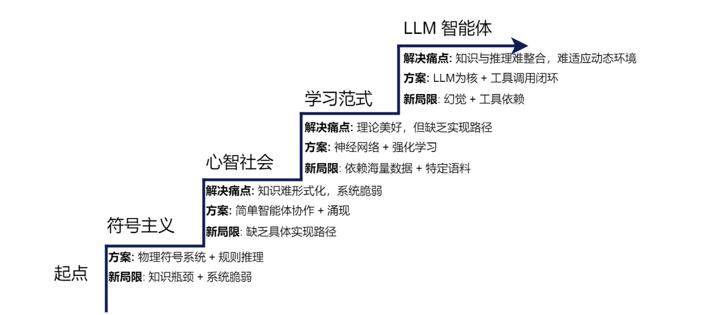
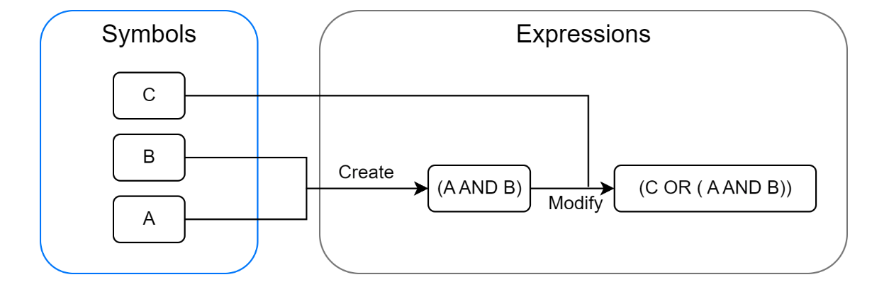
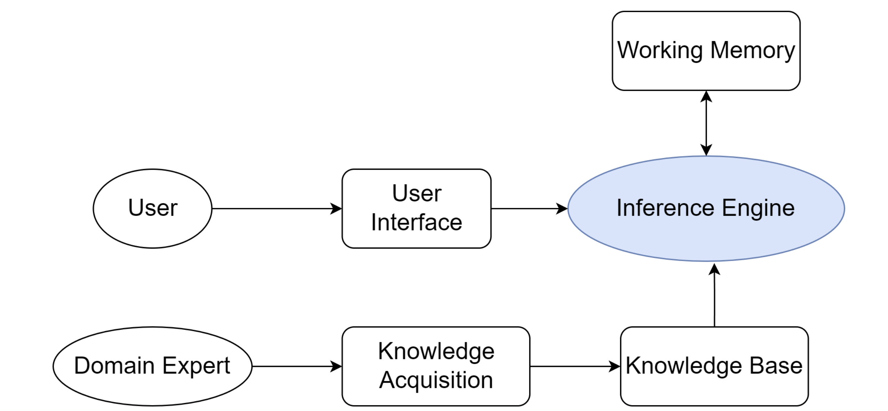
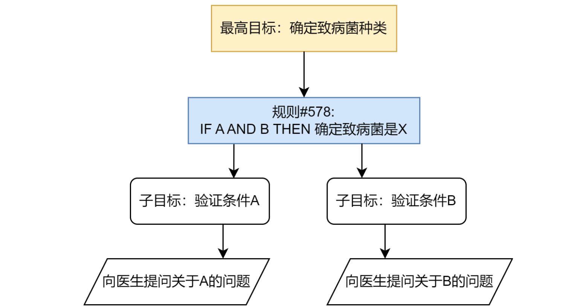
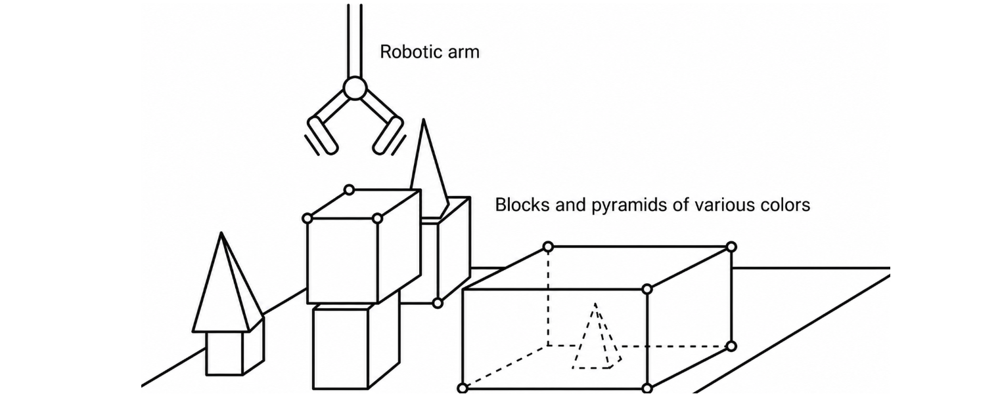
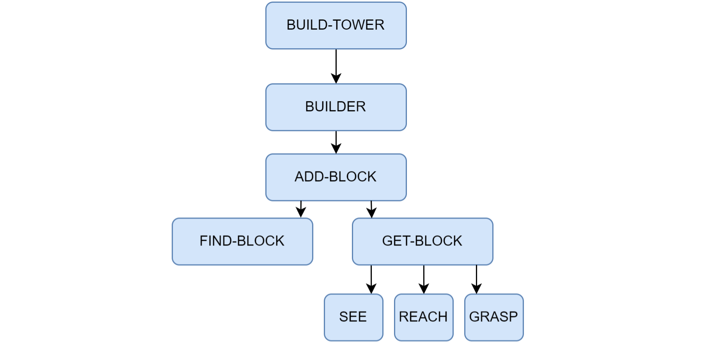
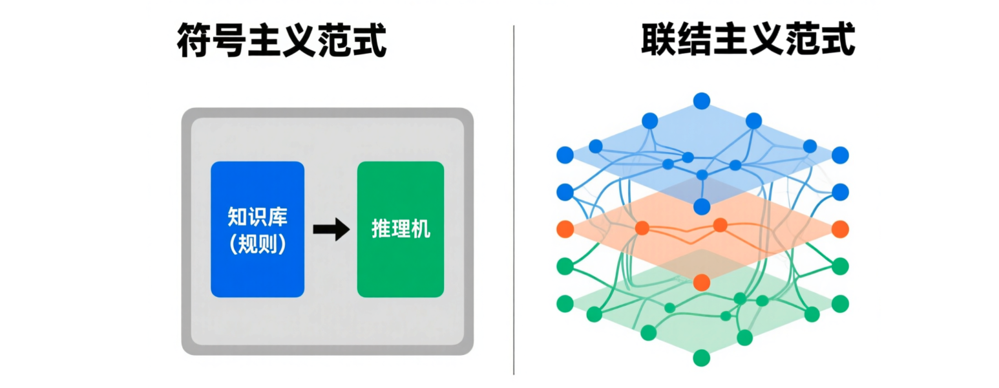
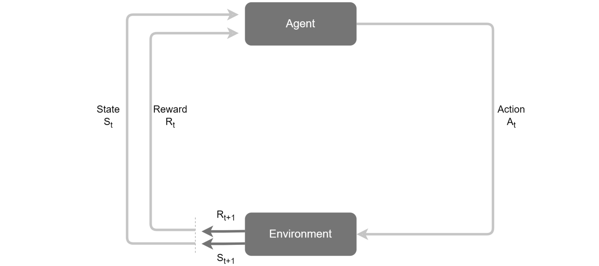
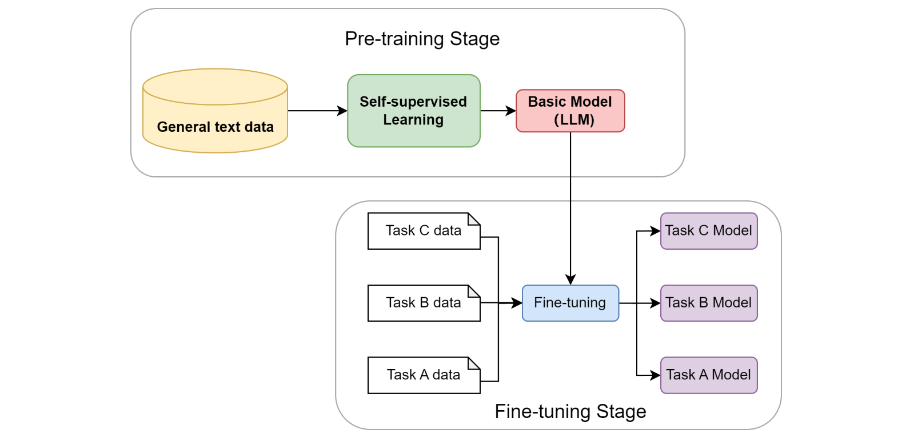

# 📘 第二章 智能体发展史 (History of Agents)

> 来源说明：Hello-Agents 教程 第二章 | 本章涵盖：符号主义与 PSSH、专家系统与 MYCIN、SHRDLU、符号主义根本挑战、ELIZA 规则机器人复现、明斯基心智社会、联结主义/强化学习/预训练范式、LLM 驱动的现代智能体、三大思潮融合

---

## 🧠 核心概念总览（严格按教程顺序）

- [*知识点1: 符号主义与物理符号系统假说 (PSSH)*](#id1)
- [*知识点2: 专家系统——架构与核心组件*](#id2)
- [*知识点3: MYCIN——专家系统的巅峰案例*](#id3)
- [*知识点4: SHRDLU——积木世界的综合智能体*](#id4)
- [*知识点5: 符号主义面临的根本性挑战*](#id5)
- [*知识点6: ELIZA 的设计思想与模式匹配四步骤*](#id6)
- [*知识点7: ELIZA 核心逻辑的实现与根本局限*](#id7)
- [*知识点8: 明斯基的反思——单一整体智能模型的困境*](#id8)
- [*知识点9: 作为协作体的智能与对 MAS 的理论启发*](#id9)
- [*知识点10: 从符号到联结——联结主义*](#id10)
- [*知识点11: 基于强化学习的智能体*](#id11)
- [*知识点12: 基于大规模数据的预训练*](#id12)
- [*知识点13: 基于大语言模型的智能体*](#id13)


---

<a id="id1"></a>
## ✅ 知识点1: 符号主义与物理符号系统假说 (PSSH)

**智能的本质，就是符号的计算与处理**

主线：**每一个新范式的出现，都是为了解决上一代范式的核心"痛点"或根本局限**；新方案带来能力飞跃的同时引入新局限，又为下一代范式埋下伏笔。理解这一"问题驱动"的迭代历程，才能把握现代智能体技术选型背后的历史必然性。


**符号主义的核心思想：**

- `符号主义（Symbolicism）`——又称"逻辑 AI"或"传统 AI"，是人工智能的第一个重要范式
- 核心信念：人类的智能（尤其是逻辑推理能力）可以被**形式化的符号体系**所捕捉和复现
- 因此智能体可被视为一个**物理符号系统**：通过内部符号表示外部世界，通过逻辑推理规划行动
- 这个时代的智能体，其"智慧"**完全来源于设计者预先编码的知识库和推理规则**，而非自主学习

**物理符号系统假说 (PSSH)**——符号主义时代的理论根据：

- 1976 年由 `艾伦·纽厄尔（Allen Newell）` 和 `赫伯特·西蒙（Herbert A. Simon）`（两位图灵奖得主）共同提出，为在计算机上实现通用人工智能提供了理论指导和判定标准
- **两个核心论断**：
  1. **充分性论断**：任何一个物理符号系统，都具备产生通用智能行为的充分手段
  2. **必要性论断**：任何一个能够展现通用智能行为的系统，其本质必然是一个物理符号系统
- 物理符号系统的构成：
    
    - 一个能在物理世界中存在的系统，由**一组可被区分的符号** + **一系列对符号进行操作的过程**组成；符号可组合成更复杂的结构（如表达式），过程可创建、修改、复制和销毁符号结构

**PSSH 的深远影响**：它把对人类心智这一模糊哲学问题的研究，转化为可在计算机上工程化实现的具体问题——只要能找到正确的方式表示知识并设计有效的推理算法，就一定能创造出与人类媲美的机器智能。整个符号主义时代的研究（从专家系统到自动规划）几乎都在这一假说指引下展开。

> ⚠️ **关键区分**：充分性说"符号系统**够**产生智能"，必要性说"智能**必须**是符号系统"——后者是更强的断言，也是后来最受质疑的一点（原作习题 1 专门讨论 LLM 是否符合 PSSH）
>
> 🔄 **知识关联**：第一章从"知识表示"维度也讲过符号主义（透明但脆弱），见 [ch1-introduction-to-agents.md#id4](./ch1-introduction-to-agents.md#id4)；本章是它的完整历史展开

---

<a id="id2"></a>
## ✅ 知识点2: 专家系统——架构与核心组件

**知识与推理相分离：把专家的经验编码成 IF-THEN 规则**

在 PSSH 的直接影响下，`专家系统（Expert System）` 成为符号主义时代最重要、最成功的应用成果。核心目标是模拟人类专家在特定领域内解决问题的能力——将专家的知识和经验编码成计算机程序，使其面对相似问题时给出媲美甚至超越人类专家的结论。

**通用架构**：知识库、推理机、用户界面等核心部分。这种架构清晰体现了**知识与推理相分离**的设计思想，是符号主义 AI 的重要特征。


**知识库与推理机——"智能"的两大来源：**

- **`知识库（Knowledge Base）`**：专家系统的知识存储中心，存放领域专家的知识和经验
  - `知识表示（Knowledge Representation）` 是构建知识库的关键
  - 最常用的知识表示方法：`产生式规则（Production Rules）`——一系列 "IF-THEN" 形式的条件语句
  - 示例：`IF 病人有发烧症状 AND 咳嗽 THEN 可能患有呼吸道感染`——规则把特定情境（IF 部分，条件）与结论或行动（THEN 部分）关联起来
  - 一个复杂的专家系统可能包含成百上千条规则，共同构成庞大的知识网络
- **`推理机（Inference Engine）`**：专家系统的核心计算引擎——一个**通用的程序**，根据用户提供的事实，在知识库中寻找并应用相关规则，推导出新结论。两种工作方式：
  - **`正向链（Forward Chaining）`**：从已知事实出发，不断匹配规则的 IF 部分，触发 THEN 部分的结论，并把新结论加入事实库，直到推导出目标或无新规则可匹配——**"数据驱动"** 的推理
  - **`反向链（Backward Chaining）`**：从一个假设的目标出发（如"病人是否患有肺炎"），寻找能推导出该目标的规则，把该规则的 IF 部分作为新的子目标，如此递归，直到所有子目标都能被已知事实证明——**"目标驱动"** 的推理

> ⚠️ **关键区分**：正向链 = 数据驱动（有事实→找结论）；反向链 = 目标驱动（有假设→找证据）。诊断类系统（如 MYCIN）适合反向链，监控预测类适合正向链
>
> 💡 **理解技巧**：推理机是"通用程序"意味着它不含领域知识——换一套知识库，同一个推理机就能看另一个领域的病。这就是"知识与推理分离"的威力

---

<a id="id3"></a>
## ✅ 知识点3: MYCIN——专家系统的巅峰案例

**约 600 条规则 + 反向链 + 置信因子 = 达到人类专家水平的诊断系统**

`MYCIN` 是历史上最著名、最具影响力的专家系统之一，由斯坦福大学于 20 世纪 70 年代开发，用于辅助医生诊断**细菌性血液感染**并推荐合适的**抗生素治疗方案**。

**工作原理：**

- 通过与医生进行**问答式交互**，收集病人的症状、病史和化验结果
- 知识库包含约 **600 条**由医学专家提供的 "IF-THEN" 规则
- 推理机主要采用**反向链**方式工作：从"确定致病菌"这一最高目标出发，反向推导需要哪些证据和条件，然后向医生提问以获取这些信息
    

**不确定性处理——重要创新：**

- 医学诊断充满不确定性，MYCIN 引入 `置信因子（Certainty Factor, CF）` 的概念：用一个 **-1 到 1 之间的数值**表示一个结论的可信度
- 使系统能处理不确定的、模糊的医学知识，给出**带有可信度评估**的诊断结果——比简单的布尔逻辑更贴近现实世界

**成就与意义：**

- 在一项评估中，MYCIN 在血液感染诊断方面的表现**超过了非专业医生，甚至达到了人类专家的水平**
- 它的成功雄辩地证明了 PSSH 的有效性：通过精心的知识工程和符号推理，机器确实可以在高度复杂的专业领域展现卓越的"智能"
- MYCIN 是专家系统发展史上的里程碑，也为后续 AI 在各垂直领域的商业化应用铺平了道路

> ⚠️ **关键警告**：原作正文只说 MYCIN"超过非专业医生、达到专家水平"——但它最终**并未大规模应用于临床实践**
>
> 📋 **术语提醒**：是 `置信因子(Certainty Factor, CF)`，不是"确定性因子"——它度量的恰恰是**不确定性**

---

<a id="id4"></a>
## ✅ 知识点4: SHRDLU——积木世界的综合智能体

**首次把语言理解、推理规划与行动记忆集成于统一系统**

如果说专家系统展示了符号 AI 在专业领域的"深度"，那么由 `特里·威诺格拉德（Terry Winograd）` 于 1968-1970 年开发的 `SHRDLU` 则在"广度"上实现了革命性突破：构建一个能在"**积木世界**"微观环境中、通过**自然语言**与人类流畅交互的综合性智能体。积木世界是一个模拟的三维虚拟空间，包含不同形状、颜色和大小的积木，以及一个可抓取移动它们的虚拟机械臂。


**SHRDLU 集成的三大能力**（当时引起广泛关注的核心原因：首次将多个独立的 AI 模块集成在一个统一系统中协同工作）：

- **自然语言理解**：能解析结构复杂且含歧义的英语句子
  - 直接命令：`Pick up a big red block.`
  - **指代消解**：`Find a block which is taller than the one you are holding and put it into the box.`——系统需理解 `the one you are holding` 指代当前机械臂正抓取的物体
  - **上下文记忆**：用户先说 `Grasp the pyramid.`，接着问 `What does the box contain?`，系统能联系上下文回答
- **规划与行动**：理解指令后自主规划必要的动作序列。例如指令是"把蓝色积木放到红色积木上"，而红色积木上已有绿色积木，系统会规划出"先把绿色积木移开，再把蓝色积木放上去"
- **记忆与问答**：拥有关于环境和自身行为的记忆，用户可就此提问：
  - 询问世界状态：`Is there a large block behind a pyramid?`
  - 询问行为历史：`Did you touch any pyramid before you put the green one on the little cube?`
  - 询问行为动机：`Why did you pick up the red block?` → SHRDLU 答：`BECAUSE YOU ASKED ME TO.`

**历史地位与影响（三个方面）：**

1. **综合性智能的典范**：在此之前 AI 研究大多聚焦单一功能；它首次将语言理解、推理规划与行动记忆集成于统一系统，其"**感知-思考-行动**"的闭环设计奠定了现代智能体研究的基础
2. **微观世界研究方法的普及**：证明在规则明确的简化环境中探索和验证复杂智能体基本原理是可行的，深刻影响了后续的机器人学与 AI 规划研究
3. **引发的乐观与反思**：激发了对 AGI 的早期乐观预期，但其能力严格局限于积木世界——引发关于"**符号处理**"与"**真正理解**"之间差异的长期思辨，揭示了通往通用智能的深层挑战

> 💡 **理解技巧**：SHRDLU 已经具备 Agent 的完整雏形——感知（语言输入）、思考（规划）、行动（机械臂）、记忆（问答）——只是世界太小。第一章的"智能体循环"在这里能找到历史源头
>
> ⚠️ **关键警告**：SHRDLU 的成功**恰恰因为它运行在规则完备的封闭世界**里——这个限定条件在知识点5的"系统脆弱性"中会再次回响

---

<a id="id5"></a>
## ✅ 知识点5: 符号主义面临的根本性挑战

**从微观世界走向开放现实时，方法论本身失灵了**

尽管早期项目成就显著，但从 20 世纪 80 年代起，符号主义 AI 在从"微观世界"走向开放、复杂的现实世界时，遇到了其方法论固有的根本性难题，可归结为两大类。

**（1）常识知识与知识获取瓶颈**

符号主义智能体的"智能"完全依赖知识库的质量和完备性，而构建一个能支撑真实世界交互的知识库被证明极其艰巨：

- **`知识获取瓶颈（Knowledge Acquisition Bottleneck）`**：专家系统的知识需由人类专家和知识工程师通过繁琐的访谈、提炼和编码过程构建——成本高昂、耗时漫长、难以规模化。更重要的是，人类专家的许多知识是**内隐的、直觉性的**，很难清晰表达为 "IF-THEN" 规则。试图把整个世界的知识手工符号化，被认为几乎不可能完成
- **`常识问题（Common-sense Problem）`**：人类行为依赖庞大的常识背景（"水是湿的"、"绳子可以拉不能推"），但符号系统除非被明确编码，否则对此一无所知。为广阔、模糊的常识建立完备知识库至今仍是重大挑战——`Cyc 项目`历经数十年努力，成果和应用仍非常有限

**（2）框架问题与系统脆弱性**

- **`框架问题（Frame Problem）`**：在动态世界中，智能体执行一个动作后，如何高效判断**哪些事物未发生改变**是一个逻辑难题。为每个动作显式声明所有不变的状态在计算上不可行，而人类却能毫不费力地忽略不相关的变化
- **`系统脆弱性（Brittleness）`**：符号系统完全依赖预设规则，行为非常"脆弱"——一旦遇到规则之外的微小变化或新情况便可能完全失灵，无法像人类一样灵活变通。SHRDLU 的成功正是因为它运行在规则完备的封闭世界里，而真实世界充满了例外

> 💡 **理解技巧**：两大挑战分别击中符号主义的两个假设——知识瓶颈击中"知识可以显式编码"（充分性），框架问题+脆弱性击中"规则可以覆盖世界"（封闭世界假设）
>
> 🔄 **知识关联**：知识获取瓶颈后来被预训练范式以全新方式解决，见本章 [知识点12](#id12)

---

<a id="id6"></a>
## ✅ 知识点6: ELIZA 的设计思想与模式匹配四步骤

**不"理解"也能聊天：把自然语言理解简化为基于规则的模式匹配游戏**

探讨了符号主义的理论挑战后，原作通过一个具体的编程实践——复现 AI 历史上极具影响力的早期聊天机器人 `ELIZA`——来直观感受基于规则的系统如何工作。

**ELIZA 的设计思想（2.2.1）：**

- 由 MIT 计算机科学家 `约瑟夫·魏泽鲍姆（Joseph Weizenbaum）` 于 **1966 年**发布，是早期 NLP 领域的著名尝试
- ELIZA 并非单一程序，而是一个**可执行不同"脚本"的框架**；最广为人知的脚本是 `DOCTOR`，模仿一位**罗杰斯学派的非指导性心理治疗师**
- 工作方式极其巧妙：**从不正面回答问题或提供信息**，而是识别用户输入中的关键词，应用预设的转换规则，把用户的陈述转化为开放式提问。例：用户说"我为我的男朋友感到难过"→ ELIZA 回应"你为什么会为你的男朋友感到难过？"
- 魏泽鲍姆的真实意图**不是**创造能"理解"人类情感的智能体——恰恰相反，他想证明：通过简单的句式转换技巧，机器可以在**完全不理解对话内容**的情况下营造出"智能"和"共情"的假象
- 出乎意料的是，许多与 ELIZA 交互过的人（包括他的秘书）都对其产生了情感依赖，深信它能理解自己

**算法四步骤（2.2.2）——`模式匹配（Pattern Matching）` 与 `文本替换（Text Substitution）`：**

1. **关键词识别与排序**：规则库为每个关键词（如 `mother`、`dreamed`、`depressed`）设定优先级；输入含多个关键词时，选择**优先级最高**的关键词所对应的规则处理
2. **分解规则**：找到关键词后，用带通配符（`*`）的分解规则捕获句子其余部分
   - 规则示例：`* my *`；用户输入：`"My mother is afraid of me"` → 捕获结果：`["", "mother is afraid of me"]`
3. **重组规则**：从与分解规则关联的一组重组规则中选择一条生成回应（通常**随机选择**以增加多样性），可选择性使用上一步捕获的内容
   - 规则示例：`"Tell me more about your family."` → 生成输出：`"Tell me more about your family."`
4. **代词转换**：重组前进行简单的代词转换（`I` → `you`、`my` → `your`），维持对话连贯性

**伪代码思路（原作收录）：**

```python
FUNCTION generate_response(user_input):
    // 1. 将用户输入拆分成单词
    words = SPLIT(user_input)

    // 2. 寻找优先级最高的关键词规则
    best_rule = FIND_BEST_RULE(words)
    IF best_rule is NULL:
        RETURN a_generic_response() // 例如:"Please go on."

    // 3. 使用规则分解用户输入
    decomposed_parts = DECOMPOSE(user_input, best_rule.decomposition_pattern)
    IF decomposition_failed:
        RETURN a_generic_response()

    // 4. 对分解出的部分进行代词转换
    transformed_parts = TRANSFORM_PRONOUNS(decomposed_parts)

    // 5. 使用重组规则生成回应
    response = REASSEMBLE(transformed_parts, best_rule.reassembly_patterns)

    RETURN response
```

通过这套机制，ELIZA 成功地把复杂的自然语言理解问题，简化成了一个可操作的、基于规则的模式匹配游戏。

> 💡 **理解技巧**：四步骤的先后顺序就是信息流动的管道——先选规则（关键词排序），再拆句子（分解），换人称（代词转换），最后拼回答（重组）
>
> ⚠️ **关键警告**：魏泽鲍姆本想用 ELIZA **揭穿**"机器理解人"的错觉，结果用户反而对机器产生了情感依赖——设计者的意图和社会的效果完全相反，这是 AI 史上著名的反讽

---

<a id="id7"></a>
## ✅ 知识点7: ELIZA 核心逻辑的实现与根本局限

**一个迷你 ELIZA：规则字典 + 代词转换 + 随机重组**

原作将技术原理转化为一个可运行的 Python 函数——只含一小部分规则，但足以展示核心工作机制。完整代码：

```python
import re
import random

# 定义规则库:模式(正则表达式) -> 响应模板列表
rules = {
    r'I need (.*)': [
        "Why do you need {0}?",
        "Would it really help you to get {0}?",
        "Are you sure you need {0}?"
    ],
    r'Why don\'t you (.*)\?': [
        "Do you really think I don't {0}?",
        "Perhaps eventually I will {0}.",
        "Do you really want me to {0}?"
    ],
    r'Why can\'t I (.*)\?': [
        "Do you think you should be able to {0}?",
        "If you could {0}, what would you do?",
        "I don't know -- why can't you {0}?"
    ],
    r'I am (.*)': [
        "Did you come to me because you are {0}?",
        "How long have you been {0}?",
        "How do you feel about being {0}?"
    ],
    r'.* mother .*': [
        "Tell me more about your mother.",
        "What was your relationship with your mother like?",
        "How do you feel about your mother?"
    ],
    r'.* father .*': [
        "Tell me more about your father.",
        "How did your father make you feel?",
        "What has your father taught you?"
    ],
    r'.*': [
        "Please tell me more.",
        "Let's change focus a bit... Tell me about your family.",
        "Can you elaborate on that?"
    ]
}

# 定义代词转换规则
pronoun_swap = {
    "i": "you", "you": "i", "me": "you", "my": "your",
    "am": "are", "are": "am", "was": "were", "i'd": "you would",
    "i've": "you have", "i'll": "you will", "yours": "mine",
    "mine": "yours"
}

def swap_pronouns(phrase):
    """
    对输入短语中的代词进行第一/第二人称转换
    """
    words = phrase.lower().split()
    swapped_words = [pronoun_swap.get(word, word) for word in words]
    return " ".join(swapped_words)

def respond(user_input):
    """
    根据规则库生成响应
    """
    for pattern, responses in rules.items():
        match = re.search(pattern, user_input, re.IGNORECASE)
        if match:
            # 捕获匹配到的部分
            captured_group = match.group(1) if match.groups() else ''
            # 进行代词转换
            swapped_group = swap_pronouns(captured_group)
            # 从模板中随机选择一个并格式化
            response = random.choice(responses).format(swapped_group)
            return response
    # 如果没有匹配任何特定规则，使用最后的通配符规则
    return random.choice(rules[r'.*'])

# 主聊天循环
if __name__ == '__main__':
    print("Therapist: Hello! How can I help you today?")
    while True:
        user_input = input("You: ")
        if user_input.lower() in ["quit", "exit", "bye"]:
            print("Therapist: Goodbye. It was nice talking to you.")
            break
        response = respond(user_input)
        print(f"Therapist: {response}")
```

**运行示例（原作对话）：**

```text
Therapist: Hello! How can I help you today?
You: I am feeling sad today.
Therapist: How long have you been feeling sad today?
You: I need some help with my project.
Therapist: Are you sure you need some help with your project?
You: My mother is not happy with my work.
Therapist: Tell me more about your mother.
You: quit
Therapist: Goodbye. It was nice talking to you.
```

**规则驱动系统的三大根本局限**：

- **缺乏语义理解**：系统不理解词义。面对 "I am **not** happy" 的输入，仍会机械地匹配 `I am (.*)` 规则并生成语义不通的回应——因为它无法理解否定词 "not" 的作用
- **无上下文记忆**：系统是**无状态的（Stateless）**，每次回应仅基于当前单句输入，无法进行连贯的多轮对话
- **规则的扩展性问题**：增加更多规则会导致规则库规模爆炸式增长，规则间的冲突与优先级管理变得极其复杂，最终系统难以维护

**`ELIZA 效应（ELIZA Effect）`**：尽管缺陷显而易见，许多用户却相信 ELIZA 能理解自己。这种**智能的幻觉**主要源于其巧妙的对话策略（扮演被动的提问者、使用开放式模板）以及**人类天生的情感投射心理**。

**核心矛盾总结**：ELIZA 的实践清晰揭示了符号主义方法的核心矛盾——系统看似智能的表现完全依赖设计者预先编码的规则；面对真实世界语言的无限可能性，这种穷举式的方法注定不可扩展。**系统没有真正的理解，只是在执行符号操作**——这正是其脆弱性的根源。

> 💡 **理解技巧**：注意代码里 `rules` 字典的遍历顺序就是优先级——最后的 `r'.*'` 通配规则是兜底（"Please tell me more."），保证任何输入都有回应，这是"从不冷场"的诀窍
>
> 🔄 **知识关联**：ELIZA 的"无状态"缺陷对照第一章旅行助手的 `prompt_history` 记忆设计，见 [ch1-introduction-to-agents.md#id9](./ch1-introduction-to-agents.md#id9)；"ELIZA 效应"在今天表现为用户对 ChatGPT 类产品的过度信任

---

<a id="id8"></a>
## ✅ 知识点8: 明斯基的反思——单一整体智能模型的困境

**"The trick is that there is no trick."——智能的力量来自多样性**

符号主义的探索和 ELIZA 的实践共同指向一个问题：通过预设规则构建的、单一的、集中的推理引擎，似乎难以通向真正的智能——无论规则库多庞大，系统面对真实世界的模糊性、复杂性和无穷变化时总是僵化而脆弱。`马文·明斯基（Marvin Minsky）` 没有继续为单一推理核心添加更多规则，而是在 `《心智社会》（The Society of Mind）` 中提出了革命性的论断：

> *"What magical trick makes us intelligent? The trick is that there is no trick. The power of intelligence stems from our vast diversity, not from any single, perfect principle."*

**2.3.1 对单一整体智能模型的反思：**

- 20 世纪 70-80 年代，符号主义局限日益明显：专家系统无法拥有儿童般的常识；SHRDLU 无法理解积木世界之外的任何事情；ELIZA 对对话内容本身一无所知
- 这些系统都遵循**自上而下**的设计思路：一个全知全能的中央处理器，根据一套统一的逻辑规则处理信息和做出决策
- 明斯基提出的三个根本性问题：
  - **"理解"是什么？** 理解一个故事是单一能力，还是视觉化、逻辑推理、情感共鸣、社会关系常识等**数十种不同心智过程协同工作**的结果？
  - **"常识"是什么？** 是包含数百万条逻辑规则的庞大知识库（如 Cyc 项目的尝试），还是一种**分布式的、由无数具体经验和简单规则片段交织而成的网络**？
  - **智能体应该如何构建？** 继续追求完美的、统一的逻辑系统，还是承认智能本身就是"不完美"的、由许多功能各异甚至彼此冲突的简单部分组成的大杂烩？
- 明斯基的判断：强行将多样化的心智活动塞进一个僵化的逻辑框架中，正是导致早期 AI 研究停滞不前的根源

基于这样的反思，明斯基提出了颠覆性构想：不再把心智视为**金字塔式的层级结构**，而是将其看作一个**扁平化的、充满互动与协作的"社会"**。

> 💡 **理解技巧**：明斯基的三个问题本质是同一个——"智能是单一的还是复数的？"他的答案是复数：理解、常识、推理全都是群体协作的产物

---

<a id="id9"></a>
## ✅ 知识点9: 作为协作体的智能与对 MAS 的理论启发

**无数"无心"的简单智能体，通过激活与抑制涌现出智能**

**2.3.2 心智社会中的智能体与机构：**

- 注意：明斯基框架中的"智能体"与第一章讨论的现代智能体不同——这里指一个**极其简单的、专门化的心智过程**，它自身是"无心"的。例如负责识别线条的 `LINE-FINDER` 智能体、负责抓握的 `GRASP` 智能体
- 简单智能体被组织起来，形成功能更强大的 **`机构（Agency）`**：一组协同工作的智能体，旨在完成更复杂的任务。例如负责搭积木的 `BUILD` 机构，可能由 `SEE`、`FIND`、`GET`、`PUT` 等下层智能体或机构组成
- 它们之间通过**去中心化的激活与抑制信号**相互影响，形成动态的控制流
- **`涌现（Emergence）`** 是理解心智社会理论的关键：复杂的、有目的性的智能行为，并非由某个高级智能体预先规划，而是**从大量简单底层智能体之间的局部交互中自发产生**

**"搭建积木塔"示例**——高层目标"我要搭一个塔"激活 `BUILD-TOWER` 机构后：


1. `BUILD-TOWER` 不知道如何执行具体物理动作，唯一作用是激活下属机构（如 `BUILDER`）
2. `BUILDER` 同样很简单，可能只含一个循环逻辑：只要塔还没搭完，就激活 `ADD-BLOCK`
3. `ADD-BLOCK` 协调更具体的子任务，依次激活 `FIND-BLOCK`、`GET-BLOCK`、`PUT-ON-TOP` 三个子机构
4. 每个子机构又由更底层的智能体构成，如 `GET-BLOCK` 会激活视觉系统的 `SEE-SHAPE`、运动系统的 `REACH` 和 `GRASP`

**关键洞察**：
- 没有任何一个智能体或机构拥有整个任务的全局规划——`GRASP` 只负责抓握，它不知道什么是塔；`BUILDER` 只负责循环，它不知道如何控制手臂。
- 然而当这个由无数"无心"智能体组成的社会通过简单的激活和抑制规则相互作用时，一个看似高度智能的行为（搭建积木塔）就自然而然地**涌现**了出来。

**2.3.3 对多智能体系统的理论启发：**

心智社会理论最深远的影响，在于为 `分布式人工智能（Distributed Artificial Intelligence, DAI）` 及后来的 `多智能体系统（Multi-Agent System, MAS）` 提供了重要的概念基础。它引出的核心问题是：

> **如果一个心智内部的智能是通过大量简单智能体的协作而涌现的，那么在多个独立的、物理上分离的计算实体（计算机、机器人）之间，是否也能通过协作涌现出更强大的"群体智能"？**

这个问题直接把研究焦点从"如何构建一个全能的单一智能体"转向"如何设计一个高效协作的智能体群体"。三个方面的直接启发：

- **`去中心化控制（Decentralized Control）`**：理论核心是不存在中央控制器。MAS 完全继承了这一思想——如何设计没有中心节点的协调机制和任务分配策略，成为 MAS 的核心研究课题之一
- **`涌现式计算（Emergent Computation）`**：复杂问题的解决方案可以从简单的局部交互规则中自发产生——启发了 MAS 中大量基于涌现思想的算法，如**蚁群算法、粒子群优化**等，用于解决复杂的优化和搜索问题
- **`智能体的社会性（Agent Sociality）`**：明斯基强调智能体之间的交互（激活、抑制）；MAS 将其进一步扩展，系统研究智能体之间的**通信语言（如 ACL）、交互协议（如契约网）、协商策略、信任模型乃至组织结构**，构建真正的"计算社会"

可以说，"心智社会"理论正式开启了多智能体系统研究的序幕。

> 🔄 **知识关联**：第一章介绍的现代多智能体框架（CAMEL 角色扮演、MetaGPT 组织化工作流）正是"心智社会"思想的工程实现，见 [ch1-introduction-to-agents.md#id11](./ch1-introduction-to-agents.md#id11)；MAS 的通信协议会在 Part 3 第 10 章展开
>
> ⚠️ **关键区分**：心智社会的"智能体" ≠ 本书主体的"LLM 智能体"——前者是无心的简单过程（比喻单元），后者是有推理能力的完整系统。原作习题 4 专门讨论了该理论在 LLM 时代是否仍适用

---

<a id="id10"></a>
## ✅ 知识点10: 从符号到联结——联结主义

**如果智能无法被完全设计，那么它是否可以被学习出来？**

"心智社会"在哲学层面为群体智能指明了方向，但实现路径尚不明确；符号主义的根本性挑战也表明：仅靠预先编码的规则无法构建真正鲁棒的智能。这两条线索共同指向上述设问，开启了人工智能的"**学习**"时代——核心目标不再是手动编码知识，而是构建能**从经验和数据中自动获取知识与能力**的系统。

**联结主义的核心思想：**

作为对符号主义局限性的直接回应，`联结主义（Connectionism）` 在 20 世纪 80 年代重新兴起。与符号主义自上而下、依赖明确逻辑规则的设计哲学不同，联结主义是**自下而上**的方法，灵感来源于对生物大脑神经网络结构的模仿：

1. **知识的分布式表示**：知识并非以明确的符号或规则存储在某个知识库中，而是以**连接权重**的形式，分布式地存储在大量简单处理单元（人工神经元）的连接之间——**整个网络的连接模式本身就构成了知识**
2. **简单的处理单元**：每个神经元只执行非常简单的计算——接收其他神经元的加权输入，通过一个`激活函数`处理，将结果输出给下一个神经元
3. **通过学习调整权重**：系统的智能并非来自设计者预编的复杂程序，而是来自"学习"过程——通过接触大量样本，根据某种学习算法（如`反向传播算法`）自动、迭代地调整连接权重，使整个网络的输出逐渐接近期望目标

**范式的根本转变**：


- 联结主义范式下，智能体不再是被动执行规则的逻辑推理机，而是一个**能通过经验自我优化的适应性系统**
- 符号主义试图把人类的知识**显式编码**给机器；联结主义则试图创造出**能像人类一样学习知识**的机器

**贡献与局限**：联结主义的兴起（特别是深度学习在 21 世纪的成功）赋予智能体强大的**感知和模式识别能力**，使其能直接从原始数据（图像、声音、文本）中理解世界——这是符号主义时代难以想象的。然而，如何让智能体学会在与环境的动态交互中做出最优的**序贯决策**，还需要另一种学习范式的补充。

> ⚠️ **关键区分**：符号主义问"知识怎么写出来"，联结主义问"知识怎么学出来"——前者把机器当学生填鸭，后者把机器当婴儿养育
>
> 📋 **术语提醒**：联结主义 ≈ 第一章知识表示分类中的 `亚符号主义 AI（Sub-symbolic AI）`（神经网络/深度学习），同一思想在不同语境的名称

---

<a id="id11"></a>
## ✅ 知识点11: 基于强化学习的智能体

**联结主义解决"看到了什么"，强化学习解决"该做什么"**

联结主义主要解决感知问题（"这张图片里有什么？"），但智能体更核心的任务是进行决策（"在这种情况下，我应该做什么？"）。`强化学习（Reinforcement Learning, RL）` 正是专注于解决**序贯决策问题**的学习范式——它并非从标注好的静态数据集中学习，而是通过智能体与环境的**直接交互**，在"试错"中学习如何最大化其长期收益。

**AlphaGo 的自我对弈——强化学习的经典体现：**

- AlphaGo（智能体）观察棋盘当前布局（环境状态），决定落子位置（行动）
- 一局结束后根据胜负收到明确信号：赢 = 正向奖励，输 = 负向奖励
- 通过**数百万次**自我对弈不断调整内部策略，逐渐学会在何种棋局下选择何种行动最可能导向胜利
- 整个过程**完全自主**，不依赖人类棋谱的直接指导

**强化学习的五个核心要素：**

| 要素 | 含义 | AlphaGo 中的对应 |
|------|------|----------------|
| **智能体（Agent）** | 学习者和决策者 | 决策程序 |
| **环境（Environment）** | 智能体外部的一切，交互的对象 | 围棋规则和对手 |
| **状态（State, S）** | 环境在某一时刻的特定描述，决策的依据 | 棋盘上所有棋子的当前位置 |
| **行动（Action, A）** | 根据当前状态所能采取的操作 | 在某个合法位置落子 |
| **奖励（Reward, R）** | 环境反馈的标量信号，评价行动在特定状态下的好坏 | 终局胜利 +1，失败 -1 |

**工作模式——"感知-行动-学习"闭环**：


1. 在时间步 $t$，智能体观察到环境的当前状态 $S_t$
2. 基于 $S_t$，智能体根据其内部的 **`策略（Policy, π）`** 选择一个行动 $A_t$ 并执行——策略本质上是一个**从状态到行动的映射**，定义了智能体的行为方式
3. 环境接收到 $A_t$ 后，转移到新状态 $S_{t+1}$
4. 同时，环境反馈给智能体一个即时奖励 $R_{t+1}$
5. 智能体利用这个反馈（$S_{t+1}$ 和 $R_{t+1}$）来**更新和优化其内部策略**——这个更新过程就是学习

**学习目标——远见**：智能体的目标并非最大化某个时间步的即时奖励，而是最大化从当前时刻到未来的 **`累积奖励（Cumulative Reward）`**，也称 **`回报（Return）`**。这意味着智能体需要"远见"——有时为了未来更大的奖励需要牺牲当前的即时奖励（如围棋中的"弃子"策略）。通过在循环中不断探索、收集反馈并优化策略，智能体最终学会在复杂动态环境中进行**自主决策和长期规划**。

> ⚠️ **关键区分**：监督学习从"标准答案"里学（静态标注数据集），强化学习从"奖惩信号"里学（动态交互试错）——数据需求的本质区别（原作习题 5 展开）
>
> 💡 **理解技巧**：策略 π 就是智能体的"行为习惯"——学习 = 根据奖励反馈不断修正这个习惯；累积奖励则逼它有"延迟满足"的能力
>
> 🔄 **知识关联**：RL 与 LLM 的结合（RLHF、Agentic-RL）会在 Part 3 第 11 章展开（待补充）

---

<a id="id12"></a>
## ✅ 知识点12: 基于大规模数据的预训练

**先上学再上岗：让智能体在学具体任务前就拥有对世界的广泛理解**

强化学习赋予智能体从交互中学习决策策略的能力，但通常需要海量的、针对特定任务的交互数据——智能体在学习之初**缺乏先验知识**，需要从零开始构建对任务的理解。无论符号主义试图手动编码的常识，还是人类决策时依赖的背景知识，在 RL 智能体中都是缺失的。如何让智能体在开始学习具体任务前就先具备对世界的广泛理解？答案最终在 `自然语言处理（Natural Language Processing, NLP）` 领域浮现：基于大规模数据的 **`预训练（Pre-training）`**。

**传统 NLP 模式的问题**：预训练范式出现之前，NLP 模型通常为单一特定任务（情感分析、机器翻译）在专门标注的中小规模数据集上从零独立训练——知识面狭窄、难以跨任务泛化、每个新任务都要耗费大量人力标注数据。

**"预训练-微调"范式的两步核心思想**：


1. **预训练阶段**：先在包含互联网级别海量文本的通用语料库上，通过 **`自监督学习（Self-supervised Learning）`** 训练一个超大规模神经网络。目标不是完成任何特定任务，而是学习语言本身的内在规律、语法结构、事实知识以及上下文逻辑——最常见的训练目标是"**预测下一个词**"
2. **`微调（Fine-tuning）`阶段**：预训练完成后模型已学到丰富知识；针对特定下游任务，只需使用**少量**该任务的标注数据微调，即可让模型适应对应任务

**大型语言模型的诞生与涌现能力：**

- 在数万亿级别的文本上预训练后，LLM 的神经网络权重实际上构建了一个**关于世界知识的、高度压缩的隐式模型**——以一种全新的方式解决了符号主义时代最棘手的"知识获取瓶颈"
- 更令人惊讶的是：当模型规模（参数量、数据量、计算量）跨越某个阈值后，开始展现出未被直接训练的、预料之外的 **`涌现能力（Emergent Abilities）`**：
  - **`上下文学习（In-context Learning）`**：无需调整模型权重，仅在输入中提供**几个示例（Few-shot）**甚至**零个示例（Zero-shot）**，模型就能理解并完成新任务
  - **`思维链（Chain-of-Thought）推理`**：引导模型在回答复杂问题前先输出一步步的推理过程，可显著提升其在逻辑、算术和常识推理任务上的准确性
- 这些能力的出现标志着 LLM 不再仅仅是语言模型——它已演变成**兼具海量知识库和通用推理引擎双重角色**的组件

**技术拼图集齐**：符号主义提供了逻辑推理的框架，联结主义和强化学习提供了学习与决策的能力，而 LLM 提供了前所未有的、通过预训练获得的世界知识和通用推理能力——下一节看它们如何在现代智能体设计中融为一体。

> 💡 **理解技巧**：预训练解决知识瓶颈的思路很"狡猾"——不手工编码知识，而是让模型从海量文本中自己"读"出来；知识从"规则库里的符号"变成了"权重里的统计模式"
>
> 🔄 **知识关联**："预测下一个词"、自监督、涌现能力的技术细节在第三章展开，见 [ch3-llm-fundamentals.md#id1](./ch3-llm-fundamentals.md#id1)

---

<a id="id13"></a>
## ✅ 知识点13: 基于大语言模型的智能体

**历史上的技术思想，在现代 Agent 架构中融为一体**

随着 LLM 技术飞速发展，以 LLM 为核心的智能体已成为 AI 领域的新范式——不仅理解和生成人类语言，更能通过与环境的交互，自主地感知、规划、决策和执行任务。

**LLM 驱动智能体的核心工作流**（对应原作图 2.10 核心组件架构）——一个由多模块协同、持续迭代的闭环：

1. **`感知 (Perception)`**：流程始于**感知模块（Perception Module）**。它通过传感器从**外部环境（Environment）**接收原始输入，形成**观察（Observation）**——用户指令、API 返回的数据或环境状态的变化，处理后传递给思考阶段
2. **`思考 (Thought)`**：智能体的认知核心，由**规划模块（Planning Module）**和 **LLM** 协同工作
   - **规划与分解**：规划模块接收观察信息进行高级策略制定，通过 **`反思（Reflection）`** 和 **`自我批判（Self-criticism）`** 等机制，把宏观目标分解为更具体、可执行的步骤
   - **推理与决策**：作为中枢的 LLM 接收规划模块的指令，并与**记忆模块（Memory）**交互整合历史信息，进行深度推理，最终决策出下一步要执行的具体操作——通常表现为一个 **`工具调用（Tool Call）`**
3. **`行动 (Action)`**：由**执行模块（Execution Module）**负责——解析 LLM 生成的工具调用指令，从**工具箱（Tool Use）**中选择并调用合适的工具（代码执行器、搜索引擎、API 等）与环境交互
4. **`观察 (Observation)` 与循环**：行动改变环境状态并产生结果
   - 工具执行后返回**工具结果（Tool Result）**给 LLM，构成对行动效果的直接反馈；同时行动改变了环境，产生全新的环境状态
   - "工具结果"和"新的环境状态"共同构成一轮**全新的观察**，被感知模块再次捕获；同时 LLM 根据行动结果**更新记忆（Memory Update）**，启动下一轮"感知-思考-行动"循环

这种**模块化的协同机制**与**持续的迭代循环**，构成了 LLM 驱动智能体解决复杂问题的核心工作流。

> 🔄 **知识关联**：对比第一章的循环描述——第一章讲"感知-思考-行动-观察"的阶段抽象（见 [ch1-introduction-to-agents.md#id6](./ch1-introduction-to-agents.md#id6)），本章图 2.10 给出了**模块级实现**：规划模块、记忆模块、执行模块、工具箱各就各位
>
> 💡 **理解技巧**：注意"反思"和"自我批判"被明确列为规划模块的机制——这是 RL 的"根据反馈修正策略"思想在 LLM 智能体中的化身

---

<a id="id14"></a>
## 🔑 核心要点总结

**三大思潮半世纪的交织、竞争与融合**

**2.4.5 智能体发展关键节点概览：**

AI 智能体的发展史并非笔直的单行道，而是几大核心思想流派长达半个多世纪交织、竞争与融合的历程。三大思潮主导着不同时期的研究范式：

1. **`符号主义 (Symbolism)`**：以 `赫伯特·西蒙（Herbert A. Simon）`、`明斯基（Marvin Minsky）` 等先驱为代表，认为智能的核心在于**对符号的操作与逻辑推理**——催生了 SHRDLU、知识驱动的专家系统，以及在国际象棋领域取得巨大成功的"深蓝"计算机
2. **`联结主义 (Connectionism)`**：灵感源于对大脑神经网络的模拟。尽管早期发展受限，但在 `杰弗里·辛顿（Geoffrey Hinton）` 等研究者的推动下，**反向传播算法**为神经网络的复苏奠定了基础；最终随深度学习时代的到来，通过卷积神经网络、Transformer 等模型成为当前的主流
3. **`行为主义 (Behaviorism)`**：强调智能体通过与环境的**互动和试错**学习最优策略，其现代化身为强化学习——从早期的 TD-Gammon 到与深度学习结合并击败人类顶尖棋手的 AlphaGo，为智能体赋予了从经验中习得复杂决策行为的能力

**进入 21 世纪 20 年代的深度融合**：以 GPT 系列为代表的大语言模型，本身是**联结主义的产物**，却成为了执行**符号推理**、进行工具调用和规划决策的核心"大脑"——形成了**神经-符号结合**的现代智能体架构。

- 原作图 2.11 梳理了从 20 世纪 50 年代至今的关键理论、项目与事件（智能体发展演进时间线）
- 原作图 2.12 展示了当前 AI Agent 技术栈全貌（由 `Letta` 公司于 2024 年 11 月发布），将相关工具、平台和服务分层分类，是理解当前市场格局和技术选型的参考

**2.5 本章小结（四次范式革命）：**

- **符号主义的探索与局限**：以专家系统为代表的早期智能体尝试通过"知识+推理"模拟智能；亲手构建基于规则的聊天机器人（ELIZA），深刻体会了这一范式的能力边界与根本性挑战
- **分布式智能思想的萌芽**：明斯基的"心智社会"理论揭示了复杂的整体智能可以从简单局部单元的交互中涌现，为多智能体系统研究提供了哲学启发
- **学习范式的演进**：联结主义赋予感知世界的能力 → 强化学习学会交互中的最优决策 → 大规模预训练的 LLM 提供前所未有的世界知识和通用推理能力
- **现代智能体的诞生**：通过对 LLM 驱动智能体核心组件（模型、记忆、规划、工具等）和工作原理的分析，理解历史上的技术思想如何在现代 Agent 架构中实现技术融合

**本章的终极洞察**：智能体的发展并非简单的技术迭代，而是一场关于**如何定义"智能"、获取"知识"、进行"决策"**的思想变革。

**下一章预告**：既然现代智能体的核心是大型语言模型，深入理解其底层原理便至关重要——第三章聚焦大语言模型本身，见 [ch3-llm-fundamentals.md](./ch3-llm-fundamentals.md)。

---
