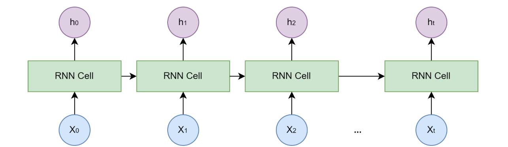
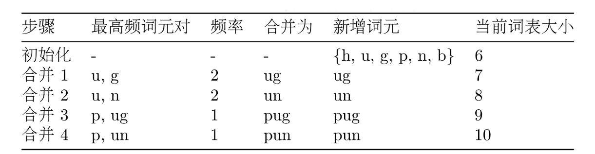

# 📘 第三章 大语言模型基础 (Fundamentals of Large Language Models)

> 来源说明：Hello-Agents 教程 第三章 | 本章涵盖：语言模型演进（N-gram → RNN → Transformer）、Transformer 架构拆解、Decoder-Only 与自回归生成、Prompt Engineering、Tokenization 与 BPE、模型选型、缩放法则与幻觉

---

## 🧠 核心概念总览（严格按教程顺序）

- [*知识点1: 语言模型的演进：N-gram → RNN → Transformer*](#id1)
- [*知识点2: Transformer 架构核心组件*](#id2)
- [*知识点3: Decoder-Only 架构与自回归生成*](#id3)
- [*知识点4: 模型采样参数*](#id4)
- [*知识点5: 零样本、单样本与少样本提示*](#id5)
- [*知识点6: 思维链 (Chain-of-Thought)*](#id6)
- [*知识点7: 文本分词 (Tokenization) 与 BPE 算法*](#id7)
- [*知识点8: 缩放法则与模型幻觉*](#id8)

---

## ✅ 知识点1: 语言模型的演进：N-gram → RNN → Transformer

**从"数词频"到"理解语义"，语言模型经历了什么？**

语言模型的根本任务是计算一个词序列出现的概率。从统计方法到深度学习，三代模型各自解决了不同的核心问题。

- **N-gram 模型**：基于`马尔可夫假设(Markov Assumption)`——一个词的出现概率只与前面 n-1 个词有关
  - 概率通过`最大似然估计(MLE)`计算：$P(w_i|w_{i-1}) = \frac{Count(w_{i-1}, w_i)}{Count(w_{i-1})}$
  - 两个致命缺陷：**数据稀疏性**（如果一个词序列从未在语料库中出现，其概率估计就为 0）和**泛化能力差**（不理解语义相似性）

- **神经网络语言模型**：引入`词嵌入(Word Embedding)`将词映射为连续向量
  - 语义相近的词在向量空间中距离相近
  - 用`余弦相似度(Cosine Similarity)`度量词间关系
  - 解决了泛化问题，但上下文窗口仍然固定，为了预测下一个词，它只能看到前 n−1 个词，再早的历史信息就被丢弃了

- **RNN/LSTM**：引入`隐藏状态(Hidden State)`实现"记忆"
  - RNN 结构图为例子：
    
    - 当前输入：`xₜ`
    - 上一个时刻的记忆：`hₜ₋₁`
    - 然后产生：当前新的记忆：hₜ
  - 但**串行计算**的本质限制了记忆能力:
    - `h₀ → h₁ → h₂ → h₃ → ... → h₁₀₀`
    - 经过这么多次更新以后，最开始的信息很容易越来越弱

> ⚠️ **关键区分**：N-gram 是"统计"方法，RNN 是"神经"方法，Transformer 是"注意力"方法——三代模型解决的核心问题各不相同

---

## ✅ 知识点2: Transformer 架构核心组件

**现代大语言模型的基石——完全基于注意力机制**

Transformer 2017 年由 Google 提出，完全抛弃循环结构，通过`注意力(Attention)`机制实现并行计算。

- **整体结构**：`编码器(Encoder)`-`解码器(Decoder)` 架构
  - Encoder：理解输入序列，生成上下文向量表示
  - Decoder：基于 Encoder 的理解和已生成的前文，逐步生成输出

- **自注意力 (Self-Attention)** 的机制：
  - 它允许模型在处理序列中的每一个词时，都能兼顾句子中的所有其他词，并为这些词分配不同的“注意力权重”。权重越高的词，代表其与当前词的关联性越强，其信息也应该在当前词的表示中占据更大的比重。
- **自注意力 (Self-Attention)** 的核心三角色：为了实现上述过程，自注意力机制为每个输入的词元向量引入了三个可学习的角色：

  | 角色 | 含义 | 类比 |
  |------|------|------|
  | `Query(Q)` | 当前词元主动"查询"其他词元 | 学生在考试中查资料 |
  | `Key(K)` | 可被查询的词元"标签" | 资料的索引/目录 |
  | `Value(V)` | 词元携带的"内容" | 资料的实际内容 |

  - 公式：$\text{Attention}(Q,K,V) = \text{softmax}\left(\frac{QK^T}{\sqrt{d_k}}\right)V$
  - 整个计算过程可以分为以下几步，我们可以把它想象成一次高效的开卷考试：
    1. **准备“考题”和“资料”**：对于句子中的每个词，都通过权重矩阵生成其`Q`,`K`,`V`向量
    2. **计算相关性得分**：要计算词`A`的新表示，就用词`A`的`Q`向量，去和句子中所有词（包括`A`自己）的`K`向量进行点积运算。这个得分反映了其他词对于理解词A的重要性。
    3. **稳定化与归一化**：将得到的所有分数除以一个缩放因子$\sqrt{d_k}$
    4. **加权求和**：将上一步得到的权重分别乘以每个词对应的`V`向量，然后将所有结果相加。最终得到的向量，就是词`A`融合了全局上下文信息后的新表示

- **多头注意力 (Multi-Head Attention)**：将 Q/K/V 切分为 h 份，独立计算后拼接
  - 让模型同时关注多种关系（指代、时态、从属等）

- **前馈网络 (FFN)**：$\text{FFN}(x) = \max(0, xW_1 + b_1)W_2 + b_2$
  - 先扩大再缩小（`d_ff = 4 × d_model`），提取高阶特征

- **残差连接 + 层归一化**：
  - 残差连接：$\text{Output} = x + \text{Sublayer}(x)$，解决`梯度消失(Vanishing Gradients)`
  - 层归一化：解决`内部协变量偏移(Internal Covariate Shift)`，加速收敛

- **位置编码 (Positional Encoding)**：用正弦/余弦函数为每个位置生成唯一向量
  - 解决注意力机制不包含顺序信息的问题
  - 位置编码的核心思想是，为输入序列中的每一个词元嵌入向量，都额外加上一个能代表其绝对位置和相对位置信息的“位置向量”
  - 公式：$PE_{(pos,2i)} = \sin\left(\frac{pos}{10000^{2i/d_{\text{model}}}}\right)$，$PE_{(pos,2i+1)} = \cos\left(\frac{pos}{10000^{2i/d_{\text{model}}}}\right)$

> 📋 **术语提醒**：`Self-Attention(自注意力)` = 序列中每个词都"看"所有其他词，计算相关性权重后加权求和

---

## ✅ 知识点3: Decoder-Only 架构与自回归生成

**GPT (Generative Pre-trained Transformer) 的核心思想：预测下一个词就够了**

- GPT 的简化：**完全抛弃编码器，只保留解码器**
- `自回归(Autoregressive)`工作模式：
  1. 给定起始文本
  2. 预测下一个最可能的词
  3. 将生成的词拼接到输入末尾
  4. 重复直到完成
- **掩码自注意力 (Masked Self-Attention)**：你可能会问，在训练时模型通常会一次性拿到完整文本，那么它是如何保证学习预测第 t+1 个词时，不去“偷看”更后面的答案呢？- **用因果掩码阻止模型"偷看"后面的词**
  - 将当前位置之后的注意力分数设为负无穷 → Softmax 后概率为 0
  - 保证训练方式与生成方式一致

- **Decoder-Only 的优势**：
  - 训练目标统一——"预测下一个词"适合海量无标注数据
  - 结构简单——易于规模化扩展
  - 天然适合生成——与对话、写作、代码生成完美契合

> 💡 **理解技巧**：可以把 Decoder-Only 想象成一个"文字接龙"游戏——不断回顾已写内容，思考下一个字该写什么

---

## ✅ 知识点4: 模型采样参数

**控制模型输出的"性格"**

- 三个核心采样参数：

  | 参数 | 原理 | 效果 |
  |------|------|------|
  | `Temperature` | 调整 Softmax 分布陡峭度：$p_i^{(T)} = \frac{e^{z_i/T}}{\sum e^{z_j/T}}$ | T↓ 更确定，T↑ 更发散 |
  | `Top-k` | 只保留概率最高的 k 个候选，归一化后采样 | k=1 时退化为贪心 |
  | `Top-p` | 累积概率 ≥ p 的最小集合，归一化后采样 | 动态适应分布长尾 |

- **协同顺序**：温度调整 → Top-k → Top-p（Top-k 和 Top-p 通常二选一）
- **Temperature 适用场景**：
  - 低温度（<0.3）：事实性任务——问答、代码生成
  - 中温度（0.3-0.7）：日常对话、常规创作
  - 高温度（>0.7）：创意任务——诗歌、头脑风暴

> ⚠️ **关键区分**：Temperature 调整**所有** token 的概率分布；Top-k 和 Top-p **截断**候选集——作用机制完全不同

---

## ✅ 知识点5: 零样本、单样本与少样本提示

**给模型多少示例，效果天差地别**

- 三种提示类型：

  | 类型 | 英文名 | 说明 | 适用场景 |
  |------|--------|------|---------|
  | 零样本 | `Zero-shot` | 不给示例，直接下指令 | 简单、常见任务 |
  | 单样本 | `One-shot` | 给一个完整示例 | 需要特定格式 |
  | 少样本 | `Few-shot` | 给多个示例，覆盖不同情况 | 复杂、边界模糊的任务 |

- **指令调优 (Instruction Tuning)**：用"指令-回答"格式数据微调模型
  - 早期的 GPT 模型（如 GPT-3）主要是“文本补全”模型，它们擅长根据前面的文本续写，但不一定能很好地理解并执行人类的指令
  - 现代模型（ChatGPT、DeepSeek、Qwen）都经过指令调优
  - 使得直接用自然语言下指令成为可能

- **基础提示技巧**：
  - `角色扮演(Role-playing)`：赋予模型特定角色
  - `上下文示例(In-context Example)`：在 prompt 中提供输入输出示例

> 💡 **理解技巧**：零样本靠模型的"常识"，少样本靠模型的"模仿"——示例越多，模型越清楚你要什么格式和风格

---

## ✅ 知识点6: 思维链 (Chain-of-Thought)

**让模型"一步一步地思考"**

- `思维链(Chain-of-Thought, CoT)`：通过引导语让模型展示推理过程，而非直接给答案
- 关键实现：在 prompt 中加入"请逐步思考"或"Let's think step by step"
- **为什么有效**：
  - 复杂问题直接给答案容易出错
  - 展示推理过程让模型更容易得出正确答案
  - 回答更可信、易于检查和纠正
- 适用场景：逻辑推理、数学计算、多步骤思考

> 💡 **理解技巧**：CoT 的本质是让模型"把思考过程写出来"——就像考试时写解题步骤，不仅答案更可能对，而且错了也知道哪步出了问题

---

## ✅ 知识点7: 文本分词 (Tokenization) 与 BPE 算法

**模型不识字——它只看到数字**

- **分词 (Tokenization)**：将文本转换为数字序列的过程，`分词器(Tokenizer)`定义切分规则

- 三种分词策略的对比：

  - **按词分词**: 直观，但是词表爆炸、模型将无法处理任何未在词表中出现过的词，这种现象我们称为“未登录词” (Out-Of-Vocabulary, OOV)
  - **按字符分词**： 词表小、无 OOV 无语义、模型需要花费更多的精力去学习如何将字符组合成有意义的词，导致学习效率低下 
  - **子词分词**：它的核心思想是：将常见的词（如 "agent"）保留为完整的词元，同时将不常见的词（如 "Tokenization"）拆分成多个有意义的子词片段（如 "Token" 和 "ization"）。这样既控制了词表的大小，又能让模型通过组合子词来理解和生成新词

- **BPE (Byte-Pair Encoding)** 算法——GPT 系列采用：
  1. 初始化词表为基本字符
  2. 统计相邻词元对频率，合并最高频的一对
  3. 重复直到词表达到预设大小
  

- **后继算法**：
  - `WordPiece`（BERT）：合并标准是"最大化语言模型概率"
  - `SentencePiece`（Llama）：将空格视为普通字符，完全可逆，语言无关

- **对开发者的实际影响**：
  - 上下文窗口按 **Token** 计算，不是字符或单词
  - API 按 Token 计费
  - 模型对分词方式敏感（`2+2` vs `2 + 2` 可能结果不同）

> ⚠️ **关键警告**：同一个词，首字母大小写不同，可能被切成完全不同的 Token 序列——设计 prompt 时要注意这个陷阱

---

## ✅ 知识点8: 缩放法则与模型幻觉

**大模型能力的来源与边界**

- **缩放法则 (Scaling Laws)**：模型性能与参数量、数据量、计算资源呈幂律关系
  - 简单来说，只要我们持续、按比例地增加这三个要素，模型的性能就会可预测地、平滑地提升，而不会出现明显的瓶颈
  - `Chinchilla 定律`修正：模型参数量和训练数据量之间存在一个最优配比，最优模型比之前认为的小，但需要**更多训练数据**
  - **缩放法则最令人惊奇的产物是“能力的涌现” (Emergent Abilities)**：模型规模达到阈值后突然展现新能力（CoT、指令遵循、多步推理）

- **模型幻觉 (Hallucination)**：生成内容与事实矛盾或编造信息
  - 三种类型：`事实性幻觉(Factual)`、`忠实性幻觉(Faithfulness)`、`内在幻觉(Intrinsic)`
  - 产生原因：训练数据错误 + 自回归机制无事实核查 + 复杂推理出错

- **缓解幻觉的方法**：

  | 层面 | 方法 | 原理 |
  |------|------|------|
  | 数据 | 高质量清洗 + `RLHF` | 从源头减少 |
  | 模型 | 新架构 + 不确定性表达 | 让模型"知道不知道" |
  | 推理 | `RAG` 检索增强 | 引入外部事实知识 |
  | 推理 | 多步推理 + 验证 | 自我检查 |
  | 推理 | 外部工具调用 | 搜索引擎/计算器精确计算 |

> ⚠️ **关键警告**：模型还有知识时效性问题——训练数据有截止日期，之后的事件无法感知。训练数据中的偏见也会被模型吸收

---

## 🔑 核心要点总结

1. **语言模型三代演进**：N-gram（统计）→ RNN（神经+记忆）→ Transformer（注意力+并行），各自解决了不同的核心问题
2. **Transformer 的核心组件**：自注意力（Q/K/V）+ 多头注意力 + FFN + 残差/层归一化 + 位置编码
3. **Decoder-Only + 自回归 = GPT**——"预测下一个词"这个简单目标驱动了一切
4. **Prompt Engineering 三大武器**：Temperature 控制随机性，Few-shot 提供示例，CoT 引导推理
5. **Tokenization 和 Scaling Laws 决定了模型的能力边界**——分词影响上下文和成本，缩放法则解释了"能力涌现"，幻觉是最大的可靠性挑战

- **N-gram 缺陷**：数据稀疏 + 泛化差
- **LSTM 三门**：遗忘门、输入门、输出门
- **Transformer 三角色**：Q（查询）、K（键）、V（值）
- **多头注意力**：多个"专家"从不同角度审视句子
- **Decoder-Only**：自回归 + 掩码自注意力
- **采样三参数**：Temperature > Top-k > Top-p（Top-k/Top-p 二选一）
- **CoT 关键语**："请逐步思考"
- **BPE 核心**：贪心合并最高频相邻词元对
- **幻觉三类型**：事实性、忠实性、内在
- **缓解幻觉首选**：`RAG`（检索增强生成）

