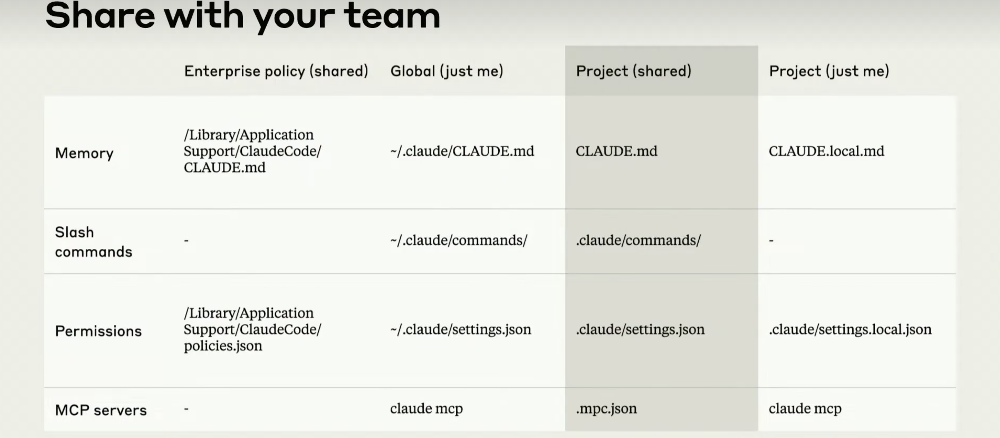
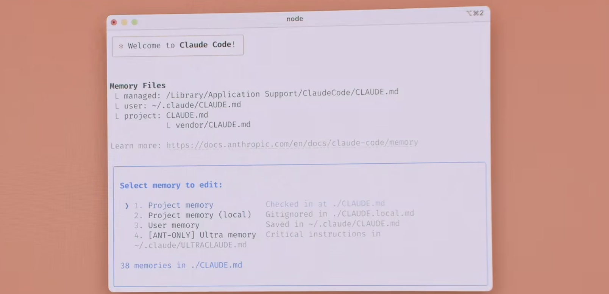

# 📘 02. 工作流篇：上下文配置与自动化 (Workflows: Context Configuration & Automation)

> 来源说明："Mastering Claude Code in 30 Minutes" 演讲 + 社区最佳实践 | 本篇涵盖：`CLAUDE.md` 上下文体系、配置层级管理、Hooks 事件驱动自动化、验证循环与上下文管理进阶

---

## 🧠 核心概念总览（严格按演讲顺序）

- [*知识点1: `CLAUDE.md` 上下文文件体系*](#id1)
- [*知识点2: `CLAUDE.md` 编写与维护*](#id2)
- [*知识点3: 配置层级体系*](#id3)
- [*知识点4: 配置一次，团队共享*](#id4)
- [*知识点5: 内置工具矩阵*](#id5)
- [*知识点6: Hooks 事件体系*](#id6)
- [*知识点7: PostToolUse Hook*](#id7)
- [*知识点8: Stop Hook 与质量守护*](#id8)
- [*知识点9: 验证循环进阶*](#id9)
- [*知识点10: 上下文管理进阶*](#id10)

---

<a id="id1"></a>
## ✅ 知识点1: `CLAUDE.md` 上下文文件体系 

**给CC更多上下文...**

- `CLAUDE.md` 是整个 Claude Code 里**最高杠杆的配置文件**：它告诉 Claude 关于你的项目、团队、工具的一切上下文
- Claude Code 启动时会**自动读取** `CLAUDE.md`，将其注入到第一个用户对话轮次中，无需手动加载
- 最简单的放置位置：**项目根目录**（与启动 `claude` 的目录相同）
- 文件层级体系：
  | 优先级 | 位置 | 作用域 | 版本控制 |
  |--------|------|--------|----------|
  | 1 | `<enterprise root>/CLAUDE.md` | 全公司 | 管理员配置 |
  | 2 | `~/.claude/CLAUDE.md` | 用户全局 | 个人维护 |
  | 3 | `<project>/CLAUDE.md`  | 项目级 | ✅ 提交到 Git |
  | 4 | `<project>/CLAUDE.local.md` | 本地覆盖自己用 | ❌ 不提交 |
  | 5 | `<project>/.claude/rules/*.md` | 用户规则集 | 支持懒加载 |

- **嵌套目录 `CLAUDE.md`**：放在子目录中的 `CLAUDE.md` 会在 Claude 处理该目录时**按需自动加载**，而不是一次性全部塞进上下文，**懒加载模式**
  - `project-root/a/CLAUDE.md` → 按需自动拉取（Pulled in on demand）
- 除了 `CLAUDE.md`，还有多种注入上下文的方式：
  | 类型    | 路径/用法                     | 调用方式              |
  | ----- | ------------------------- | ----------------- |
  | 用户级命令 | `~/.claude/commands/*.md` | `/user:命令名`       |
  | 项目级命令 | `.claude/commands/*.md`   | `/project:命令名`    |
  | 子目录命令 | `子目录/commands/*.md`       | `/project:目录:命令名` |
  | 引用文件  | 任意文件路径                    | `@路径`             |
  | 自动上下文 | 任意 `CLAUDE.md`            | 按需自动拉取            |

- **实例**：
  ```
    .claude/
    ├── commands/
    │   ├── create-release-pr.md      # 创建发布 PR
    │   ├── fix-github-issue.md       # 修复 GitHub Issue
    │   ├── get-feedback.md           # 获取反馈
    │   ├── label-github-issues.md    # 标记 GitHub Issue
    │   └── lint.md                   # 代码检查
    ├── settings.json                 # 项目设置
    └── settings.local.json           # 本地设置（不提交）
  ```

- **自定义命令**
  - `~/.claude/commands/foo.md` → 输入 `/user:foo` 调用
  - `project-root/.claude/commands/foo.md` → 输入 `/project:foo` 调用
  - `project-root/a/commands/foo.md` → 输入 `/project:a:foo` 调用

- **文件引用**
  - `project-root/a/foo.py` → 输入 `@a/foo.py` 引用该文件

- **建议**
  - 越多的上下文注入，Claude 会越聪明
  - 花时间，耐心调整上下文


> ⚠️ **关键区分**：`CLAUDE.md` ≠ Prompt。它是**持久化的项目知识**，而 Prompt 是一次性的任务描述

---

<a id="id2"></a>
## ✅ 知识点2: `CLAUDE.md` 编写与维护 

**维护`CLAUDE.md`也是维护上下文的一部分...**
- **保持精简**：目标 ≤ 200 行/文件，个人偏好约 60 行。臃肿的 `CLAUDE.md` 会导致模型 drift（行为漂移），开始忽略指令
  - **持续修剪**：如果发现 Claude 开始不听话，直接删掉 `CLAUDE.md` 从头重建——有时删掉重写比修复更快
- **团队维护工作流**：每次 Claude 做错事 → 加一条规则到 `CLAUDE.md`。PR Review 时 `@claude` 让它自动把学到的东西更新进 `CLAUDE.md`
- **核心维护原则**：**每次看到 Claude 做错了，就把规则加进 `CLAUDE.md`，这样下次它就不会再犯**。这是复利工程（Compounding Engineering）的实践
- **必须包含**：常用 Bash 命令、常用 MCP 工具、架构决策、重要文件、编码原则、禁止模式、命名规范、构建/测试/运行命令
  - 使用 `/init` 自动生成初始骨架，之后持续迭代
  - 可以选择通过 prompt improver 来优化 `CLAUDE.md` 的内容

> 🔄 **知识关联**：在会话中使用 `#`（hash）可以快速捕获当前交互的记忆，自动追加到 `CLAUDE.md`
> ⚠️ **反模式**：不要试图在 `CLAUDE.md` 里写"万能 Prompt"。越聚焦、越具体，Claude 越不会漂移

---

<a id="id3"></a>
## ✅ 知识点3: 配置层级体系 

**CC的层级管理...**
- Claude Code 的配置支持**层级化管理**，从项目到全局到企业策略，形成嵌套的优先级体系：

  | 层级 | 范围 | 是否提交 Git | 典型内容 |
  |------|------|-------------|----------|
  | **项目级 (Project)** | 单个 Git 仓库 | ✅ 可提交 | `CLAUDE.md`, Slash Commands, MCP JSON |
  | **全局级 (Global)** | 用户所有项目 | ❌ 个人 | 个人偏好、快捷方式 |
  | **企业级 (Enterprise)** | 全公司统一 | 管理员下发 | 安全策略、自动审批规则 |

- 这个层级体系**适用于几乎所有配置类型**：Slash Commands、权限策略、MCP 服务器、`CLAUDE.md`
- **权限自动审批**：如果全公司都在用某个测试命令，可以在企业策略中预授权，所有员工的 Claude Code 都会自动批准该命令
- **命令屏蔽**：如果有不应被抓取的 URL，加一条企业策略规则，员工无法覆盖，该 URL 永远不会被访问

- **命令/配置示例**
  ```json
  // 项目级 .mcp.json（提交到 Git，团队成员共享）
  {
    "mcpServers": {
      "puppeteer": {
        "type": "http",
        "url": "https://puppeteer.mcp.anthropic.com/mcp"
      }
    }
  }
  ```

---

<a id="id4"></a>
## ✅ 知识点4: 配置一次，团队共享

**配置也是非常简单直接...**
- **核心原则**：**不要每个工程师各自配置，而是配置一次、提交到 Git、全员受益**
- **团队共享的典型内容**：
  - `CLAUDE.md`：项目知识、编码规范、常用命令
  - `.claude/commands/`：团队 Slash Commands（如 `/label-issues`、`/commit-push-pr`）
  - `.mcp.json`：MCP 服务器配置（如 Puppeteer、Slack、GitHub）
  - 权限预配置：企业策略中预授权安全的常用命令
  
> ⚠️ **推荐的入门路径**：从**共享项目上下文**开始——一个人写好 `CLAUDE.md`，团队所有人都能获得更好的 Claude 体验，形成**网络效应**
- **`/memory` 命令**：**查看当前会话加载了哪些 memory 文件**
- **`#` 记忆捕获命令**：在会话中按 `#` 键，Claude Code 会弹出菜单让你选择目标 memory 文件，然后将当前对话中学到的规则或经验持久化写入该文件。
  

> 💡 **理解技巧**：Slash Commands 也可以提交到 Git——例如 Anthropic 内部用 Claude Code 自动为 GitHub Issues 打标签，背后就是一个团队共享的 Slash Command + GitHub Action


---

<a id="id5"></a>
## ✅ 知识点5: 内置工具矩阵

**CC有什么内置工具呢？**
- Claude Code 自带一组内置工具（Tools），让 Claude 可以直接与环境交互。理解这些工具的能力边界是高效使用 Claude Code 的前提
  | 工具 | 能力 | 典型用途 |
  |------|------|----------|
  | **Bash** | 执行任意 Shell 命令 | `npm test`, `git log`, `python train.py` |
  | **Read** | 读取文件内容 | 查看源码、配置文件、日志 |
  | **Write** | 创建/覆写文件 | 生成新文件 |
  | **Edit** | 精确字符串替换 | 修改现有文件（不改动无关代码） |
  | **WebFetch** | 抓取网页内容 | 查阅在线文档、API 参考 |
  | **WebSearch** | Web 搜索 | 查找最新信息、解决方案 |
  | **TODO** | 任务列表追踪 | 管理复杂多步骤任务 |
  | **Task** | 子代理调度 | 派生子代理处理子任务 |

> ⚠️ **关键区分**：`Edit` 优于 `Write`——`Edit` 做精确字符串替换，不会意外覆盖文件中不相关的部分


---

<a id="id6"></a>
## ✅ 知识点6: Hooks 事件体系

**Hooks是什么？**
- Hooks 是在 Claude Code **生命周期特定节点**自动触发的处理程序。与 AI 推理不同，Hooks 是**确定性的、可预测的**
- **Hooks vs Skills**：Hooks 是"事件驱动"（发生 X 自动做 Y），Skills 是"指令驱动"（人调用 /skill-name）。Hooks 无需人工触发
- 配置在 `.claude/settings.json` 中，12+ 种事件类型：

  | Hook 事件 | 触发时机 | 典型用途 |
  |-----------|----------|----------|
  | `PreToolUse` | 工具调用**前** | 权限路由、使用统计 |
  | `PostToolUse` | 工具调用**后** | 自动格式化、lint 修复 |
  | `UserPromptSubmit` | 用户提交 prompt 时 | 注入额外上下文 |
  | `SessionStart` | 会话启动 | 环境检查、通知 |
  | `SessionEnd` | 会话结束 | 清理、通知 |
  | `Stop` | Claude 响应结束时 | 质量检查、催促继续 |
  | `SubagentStop` | 子代理结束时 | 校验子代理产出 |
  | `PreCompact` | 上下文压缩前 | 保存关键信息 |
  | `Notification` | 通知事件 | 自定义通知渠道 |
  | `PermissionRequest` | 权限请求时 | 自动审批策略 |

- **`settings.json` 结构**：
  - 当前项目 `.claude/settings.json`：验证工具——提交到 Git，团队共享
  - 当前项目/个人 `.claude/settings.local.json`：本地调试脚本，不提交
  - 全局/所有项目 `~/.claude/settings.json`：通用规则（如格式化为 true）

- **命令/配置示例**
  ```json
  // .claude/settings.json 中的 Hooks 配置结构
  {
    "hooks": {
      "PostToolUse": [
        {
          "matcher": "Write|Edit",
          "hooks": [
            { "type": "command", "command": "bun run format || true" }
          ]
        }
      ],
      "Stop": [
        {
          "hooks": [
            { "type": "prompt", "prompt": "检查你的产出是否通过了所有测试" }
          ]
        }
      ]
    }
  }
  ```

> 🔄 **知识关联**：Hooks 和 Sub-agents、Skills、Commands 共同构成 Claude Code 的"编排层"
> 📋 **术语提醒**：`matcher(匹配器)` — 正则表达式，决定哪些工具调用会触发 Hook

---

<a id="id7"></a>
## ✅ 知识点7: PostToolUse Hook

**来看看一些 Hook 例子...**
- **`PostToolUse` 在 Claude 每次 Write/Edit 文件后自动运行格式化工具**
- 为什么需要：Claude 生成的代码**大约 10% 的情况格式不符合项目标准**（缩进、引号风格、换行等）。PostToolUse Hook 自动修复这些，人类无需手动指出
> 💡 **理解技巧**：这个 Hook 本质上是在说"每次 Claude 写文件后，自动跑项目的格式化工具，如果失败就忽略"。是质量兜底，不是流程阻塞
- 写法关键：`"command"` 后面加 `|| true` 防止格式化失败阻塞 Claude 的后续操作

- **命令/配置示例**
  ```json
  {
    "PostToolUse": [
      {
        "matcher": "Write|Edit",
        "hooks": [
          { "type": "command", "command": "bun run format || true" }
        ]
      }
    ]
  }
  ```


> ⚠️ **关键警告**：`|| true` 很重要——没有它，格式化失败会导致 Claude 的操作被标记为失败，打断工作流


---

<a id="id8"></a>
## ✅ 知识点8: Stop Hook 与质量守护

**Hook 如何保证产出质量...**
- `Stop` Hook 在 Claude 完成一个推理回合后触发。它可以注入额外的检查指令
- 使用方式：Stop Hook 提醒 Claude 在结束前验证自己的产出——"检查是否通过所有测试"、"确认没有遗漏的边界情况"
- 这本质上是在自动化"验证循环"哲学——不让 Claude 在没验证自己的工作时停下

> 💡 **理解技巧**：可以把 Stop Hook 理解为"临走前的检查清单"——每次都提醒 Claude 自检，比人类事后发现再回来修更高效

- **命令/配置示例**
  ```json
  {
    "Stop": [
      {
        "hooks": [
          {
            "type": "prompt",
            "prompt": "Before finishing, verify your changes: run tests, check for lint errors, and confirm the original task requirements are met."
          }
        ]
      }
    ]
  }
  ```


---

<a id="id9"></a>
## ✅ 知识点9: 验证循环进阶

**CC如何提升产出质量的?**

- **验证循环的核心理念**：**给 Claude 一个验证自己产出的方式——有了这个反馈循环，最终质量会提升 2-3 倍**
- **核心机制**：让 Claude 自动运行验证命令（测试、lint、构建），看到失败输出后自己修复，循环直到通过。人类只需定义"什么算通过"

> 💡 **理解技巧**：验证循环的精髓是"让 Claude 看到自己的错误"——模型看到测试失败输出后的修复能力远超"凭空猜测正确性"。不是"写代码 → 人类检查"，而是"写代码 → 自动验证 → 自动修复 → 再验证 → 通过"

> ⚠️ **关键前提**：项目必须有可自动化的验证手段（测试、lint、构建）。如果没有，先让 Claude 写测试，再让 Claude 写代码

- **验证标准类型**：

  | 验证类型 | 命令/工具 | 适用场景 |
  |----------|-----------|----------|
  | 单元测试 | `npm test`, `pytest` | 逻辑正确性 |
  | Lint | `eslint`, `ruff` | 代码风格 |
  | 类型检查 | `tsc --noEmit`, `mypy` | 类型安全 |
  | 构建 | `npm run build`, `make` | 编译/打包 |
  | 浏览器截图 | Puppeteer, Chrome DevTools MCP | UI 视觉验证 |
  | iOS 模拟器 | Xcode Simulator | 移动端验证 |

- **自动验证手段**：Stop, PostToolUse 等 Hook 在验证阶段执行配置好的验证工具

- **命令/配置示例**
  ```bash
  # 在 Claude Code 会话中的自然语言指令：
  "帮我实现用户登录功能。
  完成后运行 npm test，如果有失败的测试就修复它，直到全部通过。
  然后再跑 eslint 和 tsc。"
  ```

> 🔄 **知识关联**：验证循环在 [01-foundation.md](./01-foundation.md) 中有基础介绍；通过 Stop Hook 可实现自动化

---

<a id="id10"></a>
## ✅ 知识点10: 上下文管理进阶

**这里**
- 上下文管理是 Claude Code 使用中**最容易被忽视但影响最大**的技能
- 核心原则：保持会话上下文 ≤ 40%，300-400K token 后智能开始退化
- **进阶策略**：

  | 策略 | 命令 | 使用时机 |
  |------|------|----------|
  | 压缩上下文 | `/compact` | 上下文 > 30% 时主动执行 |
  | 带提示压缩 | `/compact "keep auth logic"` | 切换焦点但保留特定上下文 |
  | 清空重生 | `/clear` + 新 prompt | 完全切换任务方向 |
  | 回退修正 | `Esc × 2`（Double-Esc） | Claude 跑偏时回退，不污染上下文 |
  | 子代理卸载 | 派生子代理 | 大任务的子模块用独立上下文 |

> ⚠️ **关键警告**：`/clear` 是不可逆的——当前会话所有对话记忆都会丢失。只在确实需要全新开始时使用

> 💡 **理解技巧**：上下文污染就像"电话游戏"——每一轮修正都加入新的噪声。回退（`Esc × 2`）比打补丁更干净

- **命令/配置示例**
  ```bash
  /compact                         # 压缩上下文
  /compact "focus on payment module"  # 聚焦压缩
  /clear                           # 清空（会丢失当前会话所有上下文！）
  ```


> 🔄 **知识关联**：子代理的上下文隔离是解决上下文膨胀的根本方案，详见 [03-advanced-patterns.md](./03-advanced-patterns.md)

---

## 🔑 核心要点总结

1. **`CLAUDE.md` 是活文档**——保持 ≤ 200 行，每次 Claude 犯错就加一条规则，定期修剪
2. **配置层级体系覆盖一切**：项目 → 全局 → 企业，权限既能自动审批也能强制屏蔽
3. **配置一次，团队共享**——提交到 Git，形成网络效应，所有人受益
4. **Hooks 是"设置一次，受益终身"的投资**——PostToolUse 自动格式化和 Stop Hook 质量守护是最值得配置的两个
5. **验证循环是终极大招**——让 Claude 跑测试 → 看到失败 → 自己修复，质量提升 2-3 倍

---
